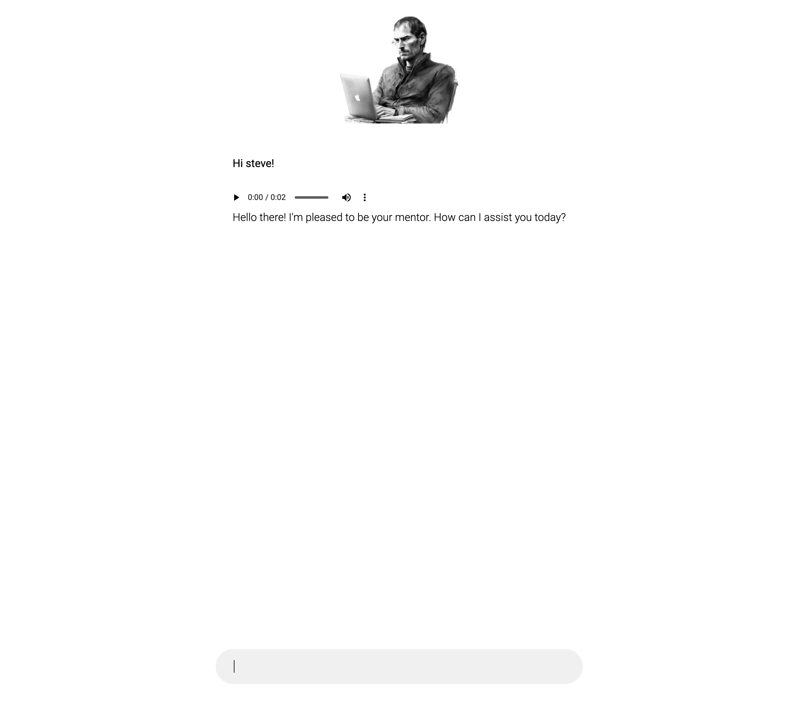

# Ai-steve-jobs
Ask AI Steve Jobs questions and hear him respond with audio that sounds just like him.




)


The app works as follows:
  1. User asks a question in the chat
  2. A request is made to a pre-prompted OpenAI model with the question
  3. The response from OpenAI is sent to Eleven Labs where we fetch a custom created clone of Steve's voice
  5. User gets a response back from AI Steve Jobs in the chat field
  6. User plays the audio and heara Steve Jobs read out his answer to you

# Requirments
  1. Get an OpenAI API key.
  2. Get an Eleven Labs API key.


# Run the app locally
  1. Download repo

  2. Install dependencies
```
npm i
```
```
npm start
```
  3. Get your own OpenAI and Eleven labs API keys and replace them in the "env.js" file

# Notes
- I had the idea of building something like this in January 2023 before I knew how to code. I've always wanted to personally talk to one of the biggest role models in my life.
- I built this in general Javascript because at the time of coding this, I had yet not learned React yet (which I now do)
 

[](https://www.youtube.com/watch?v=ek1j272iAmc)

